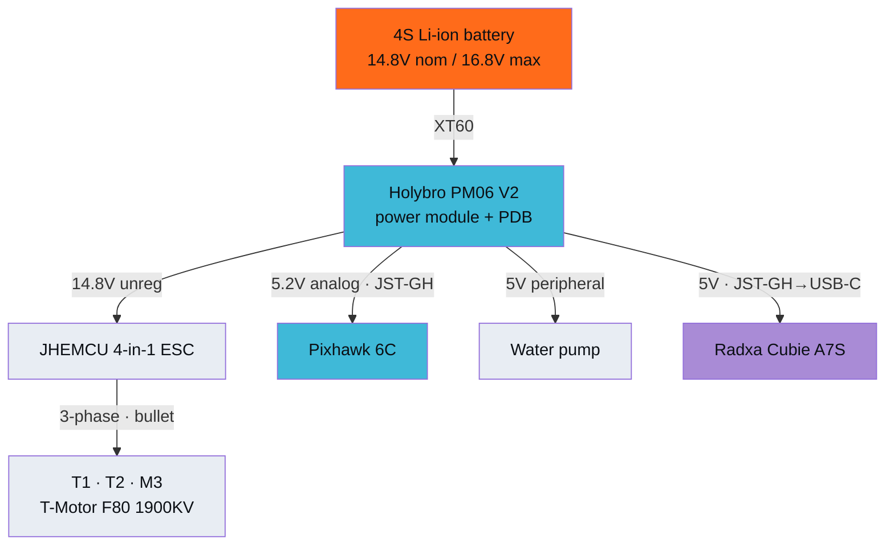
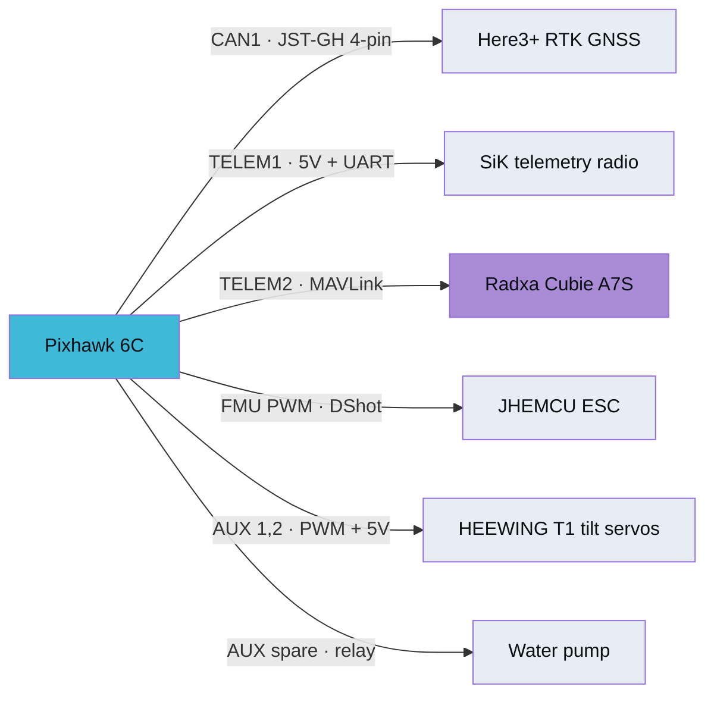
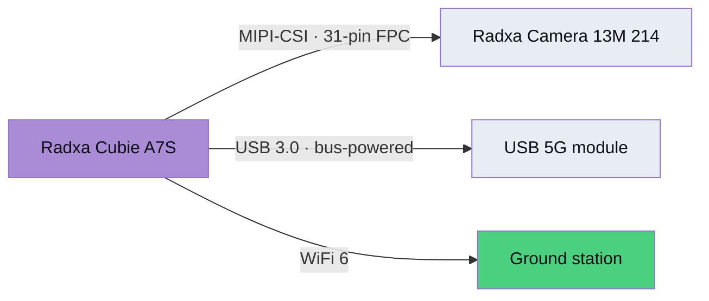

# FPMS-AS1 "Manta" — Wiring & Power Architecture

Every connection is plug-and-play. **No soldering is required anywhere in the power chain** —
this was an explicit design constraint, not a happy accident.

---

## Power tree

The **Pixhawk 6C** then redistributes regulated 5 V to its own peripherals:

And the **Cubie A7S** carries the sensing and uplink payload:

## Connector reference

| Link | Connector | Carries |
|---|---|---|
| Battery → PM06 V2 | XT60 | 14.8 V |
| PM06 V2 → ESC | Pre-wired pads | 14.8 V unregulated |
| PM06 V2 → Pixhawk POWER1 | JST-GH 6-pin | 5.2 V + analog voltage/current telemetry |
| PM06 V2 → Cubie A7S | JST-GH → USB-C adapter | 5 V |
| PM06 V2 → pump | 2-wire | 5 V |
| ESC → each motor | 3.5 mm bullet ×3 | 3-phase AC |
| Pixhawk FMU PWM → ESC | Signal wire | DShot |
| Pixhawk AUX → tilt servos | 3-pin servo | PWM signal + 5 V |
| Pixhawk CAN1 → Here3+ | JST-GH 4-pin | DroneCAN + 5 V |
| Pixhawk TELEM1 → radio | JST-GH 6-pin | UART + 5 V |
| Pixhawk TELEM2 → Cubie A7S | JST-GH → Dupont | MAVLink UART |
| Cubie A7S → camera | MIPI-CSI 31-pin FPC | image data |

## Current budget

| Load | Draw |
|---|---|
| Motors (hover, 3 × ~7.8 A) | ~23.4 A |
| Motors (peak) | ~30 A/motor |
| Avionics (FC, GPS, telemetry) | ~0.5 A |
| Companion computer + 5G | ~0.5–1 A |
| Tilt servos (holding / sweeping) | ~0.2 A / ~2 A each |
| Water pump (active) | ~0.13–0.22 A |
| **System peak** | **~23 A** |

XT60 and the 3.5 mm bullets are both rated comfortably above this. The 4-in-1 ESC is rated
45 A per channel against a ~30 A per-motor peak.

## Pack voltage under load

The 4S pack is modelled with a real Li-ion discharge curve plus ~60 mΩ internal resistance:

| State of charge | Open circuit | Under ~200 W load | Per cell |
|---|---|---|---|
| 100% | 16.80 V | 16.03 V | 4.01 V |
| 60% | 15.06 V | 14.19 V | 3.55 V |
| 20% | 13.61 V | 12.63 V | 3.16 V |

## Three things that will silently break the build

1. **PM03D will not work with Pixhawk 6C.** Digital I²C protocol vs the required analog. Use PM06 V2.
2. **Here3+ must be on CAN1.** CAN2 is unsupported in current firmware and fails silently.
3. **The FMU PWM rail needs external 5 V** from the PM06 V2 BEC, or the tilt servos never move.

## Required ArduPilot parameters

| Parameter | Value | Purpose |
|---|---|---|
| `Q_FRAME_CLASS` | tiltrotor QuadPlane | Y3 tiltrotor airframe |
| `CAN_D1_PROTOCOL` | 1 | DroneCAN for Here3+ |
| `MOT_PWM_TYPE` | 6 | DShot600 to the ESC |
| `SERVOn_FUNCTION` | tilt motor fn | Tilt servo mapping (AUX1/2) |
| `SERVOn_FUNCTION` | 28 (RELAY) | Water pump on/off |
| `SERIAL2_PROTOCOL` | 2 | MAVLink2 to the companion computer |
