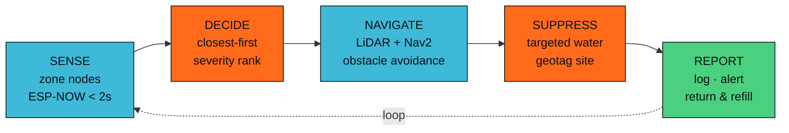

# FPMS — Fire Prevention &amp; Management System

**Autonomous cultural-heritage protection through fire prevention.**

> *"Protecting the past with the power of the present."*
> **Think Globally · Act Locally · Save Culture**

`WRO 2026 · Future Innovators`&nbsp;&nbsp;`🥇 Gold · WRO Canada Nationals 2026`&nbsp;&nbsp;`🌎 World Final · San Juan, Puerto Rico`&nbsp;&nbsp;`License: MIT`

Gold medallists at the World Robot Olympiad Canada National Final 2026, representing Canada
at the WRO International Final in San Juan, Puerto Rico.

---

## The problem

Every mainstream wildfire tool — satellites, smoke cameras, 911 calls, air tankers — watches
for **smoke**. By the time smoke appears, the site is already burning.

For Indigenous cultural heritage, that gap is fatal. A petroglyph, a ceremonial site, or a
culturally modified tree lost to wildfire is not *damaged* — it is **erased**. It cannot be
rebuilt, reprinted, or restored.

FPMS operates in the empty window *before* ignition: it finds dangerously dry ground near
heritage sites and treats it before there is anything to report.

## What it does

FPMS is an autonomous multi-device fleet that senses pre-ignition fire risk, decides on its own
which zone to serve, navigates there, applies targeted water, documents the heritage site it
just protected, and reports — with no human in the loop.

## System at a glance

| Subsystem | Count | Role |
|---|---|---|
| Zone sensor nodes | 3 | Solar ESP32; soil moisture, leaf wetness, thermal. ESP-NOW alert in under 2 s |
| Ground rovers | 2 | ROS 2 / Nav2 navigation, YOLO perception, water application, heritage documentation |
| Water stations | 2 | Autonomous refill, ArUco docking |
| Aerial scout — FPMS-AS1 "Manta" | 1 | VTOL tiltrotor; aerial survey, RTK heritage waypoint logging, precision water delivery |
| Ground HQ | 1 | ROS 2 bridge, live dashboard, SQLite mission log, TTS, alerting |

**2 rovers + 2 water stations + 3 zone nodes + 1 HQ = 8 networked devices**, plus the aircraft.

## Engineering validation

We do not present untested claims. Before committing ~CAD $1,250 to the aircraft build, we wrote a
physics simulator driven by the real motor, propeller and battery specifications and validated the
design against it. Selected results, each matching the design target:

| Metric | Simulated | Design target | Method |
|---|---|---|---|
| Hover power | 206 W | 160–220 W | Momentum theory |
| Hover throttle | 49% | 41–49% | `T = T_max · throttle²` |
| Hover endurance | 21.6 min | ~20 min | 74 Wh ÷ blended power |
| Cruise endurance | 43.2 min | — | L/D at 18 m/s |
| Stall speed | 8.8 m/s | below 15 m/s cruise | `√(2W / ρ·S·C_Lmax)` |

The simulator also verified the hover-to-cruise transition without altitude loss, tail-motor
shutdown in cruise, position hold against 10 m/s wind, a full autonomous mission to completion, and
numerical stability across frame rates. Full method: [flight simulator](docs/drone/SIMULATOR.md).

## Documentation

**System**
- [Architecture overview](docs/system/ARCHITECTURE.md) — how the whole fleet fits together
- [Mission workflow](docs/system/MISSION.md) — one alert to prevention, in five autonomous steps
- [Intelligence: edge vs cloud](docs/system/INTELLIGENCE.md) — what runs on-vehicle and what runs in the cloud

**Ground rovers**
- [Rover overview](docs/rovers/README.md) — two rovers, one rebuilt from the national champion

**Aerial platform — FPMS-AS1 "Manta"**
- [Aircraft overview](docs/drone/README.md) — Y3 tiltrotor VTOL flying wing
- [Bill of materials](docs/drone/BOM.md) — every part, with prices
- [Wiring &amp; power architecture](docs/drone/WIRING.md) — connectors, rails, compatibility notes
- [Flight simulator](docs/drone/SIMULATOR.md) — physics-based, validated against the real spec

**Project**
- [AI use disclosure](AI_USE.md) — honest account of AI assistance, per WRO rules
- [License](LICENSE)

## Technology

Our approach: prefer proven, in-production reference designs over novel unproven ones; validate
against physics before spending; and split the system so real-time safety-critical control runs
on-vehicle while heavier reasoning runs in the cloud. The [aircraft design history](docs/drone/README.md)
documents every configuration we evaluated and rejected, with reasons — including one that was
geometrically impossible.

**Edge (on-vehicle)** — ROS 2 Humble · Nav2 · SLAM Toolbox · YOLO on RKNN NPU ·
ArduPilot QuadPlane · EKF sensor fusion
**Cloud** — AWS IoT Core · multimodal reporting agent · SQLite mission log · FastAPI
**Comms** — ESP-NOW (zone alerts) · WiFi 6 (telemetry) · DDS peer swarm · 5G uplink (aerial)
**Sensing** — LiDAR · AI vision · thermal · inertial · environmental

## The team

**Aryan Wadhawan** and **Alex Tang** — David Leeder Middle School, Ontario, Canada.

Two students who designed, built, coded and present the entire system themselves.

- 🥇 **Gold** — WRO Canada National Final 2026, Montréal
- 🌎 **Qualified** — WRO International Final, San Juan, Puerto Rico, December 2026
- Category: Future Innovators · Season theme: *Robots Meet Culture*

Endorsed by **RobotShop Inc.**, one of the world's largest robotics retailers, in a letter of
recommendation from their Chief Operating Officer:

> *"What impresses us most is the purpose behind their engineering... a thoughtful, socially
> conscious application of robotics that goes well beyond what is typically expected of students
> their age."*
> — Julie Gendron, Chief Operating Officer, RobotShop Inc.

## Supporting the project

FPMS is built and funded by two students and their families. Component support, technical
mentorship, and partnership enquiries are all welcome.

📧 **scorch.sentinel.fpms@gmail.com**

## License

FPMS mission code is released under the [MIT License](LICENSE). Third-party dependencies retain
their own licenses; GPL-licensed components are kept in separate modules with documented
boundaries and are not linked into MIT-licensed FPMS code.
