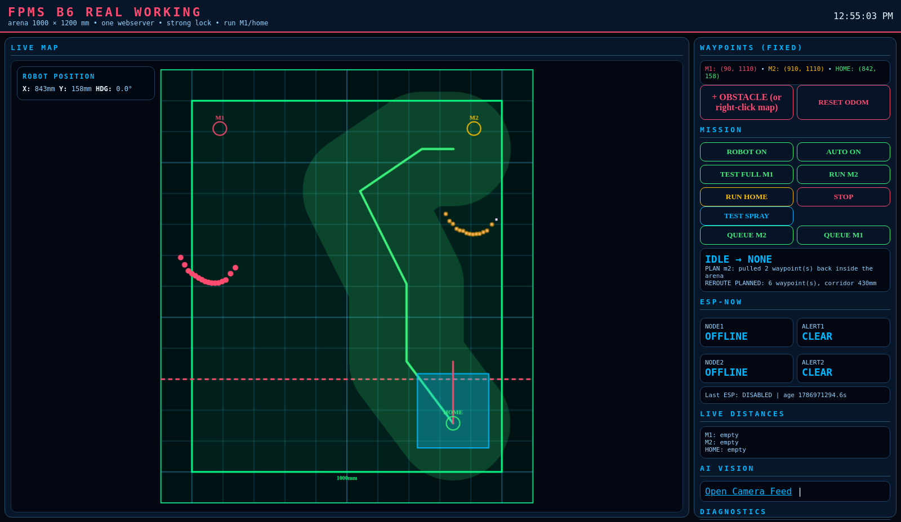
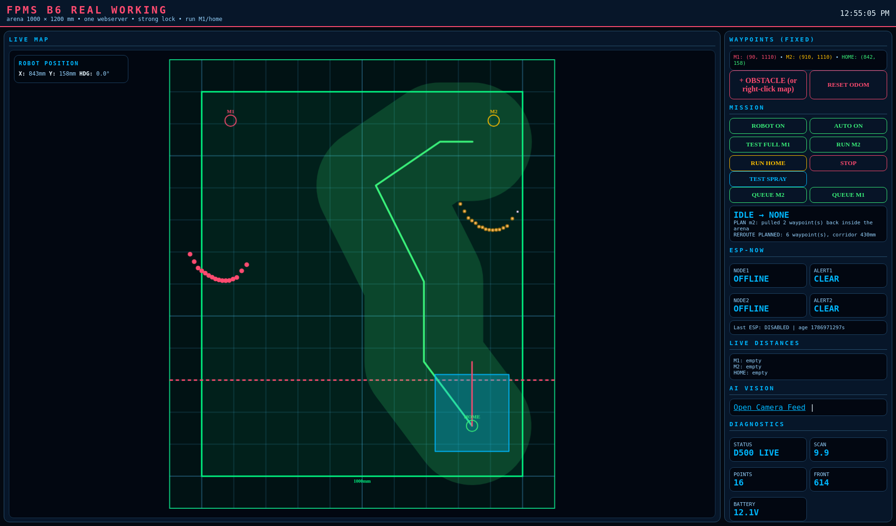

# Rover 2 — operator dashboard

The rover serves its own dashboard from the same Python process that drives it.
One web server, no external UI, no cloud dependency on the vehicle. Open a browser
on the rover's address at port **8085** and everything the rover knows is on one
screen.

This matters in competition: when something goes wrong you have seconds, not
minutes, and the answer needs to be visible without attaching a laptop debugger.

---

## Live map with a planned route


Reading the map:

| Element | Meaning |
|---|---|
| Green rectangle | The 1000 × 1200 mm arena |
| Cyan box, bottom right | HOME / start box, with the rover's heading marker |
| Red dots | Live LiDAR returns, transformed into arena coordinates |
| Orange dots | Auto-detected obstacle points |
| Dark red disk | A `NO-GO` keep-out zone, placed by right-clicking the map |
| Green line | The planned route |
| Green band | The corridor width the planner guarantees — the inflated clearance |
| M1 / M2 circles | The two target zones |

The corridor band is the useful part. It shows the *margin*, not just the line, so
an operator can see at a glance whether a plan is comfortable or scraping past
something.

## Idle



## Wide view



---

## Controls

| Control | Effect |
|---|---|
| `RUN M2` / `RUN HOME` | Execute a mission to a zone, or return home |
| `TEST FULL M1` | Full mission to zone A |
| `QUEUE M1` / `QUEUE M2` | Chain a second zone onto the running mission |
| `STOP` | Halt immediately — honoured mid-leg, mid-turn |
| `ROBOT ON/OFF` | Master motion enable |
| `AUTO ON/OFF` | Respond to zone sensor alerts without an operator |
| `+ OBSTACLE` / right-click | Drop a keep-out disk the planner must route around |
| `RESET ODOM` | Re-anchor the pose estimate to the start box |
| `TEST SPRAY` | Fire the pump without driving |

## Live telemetry

The right-hand column carries robot position and heading, LiDAR status and scan
rate, point count, battery voltage, mission state and message, the current route
summary, ESP-NOW zone-node status, and a rolling event log.

Two panels are deliberately prominent:

- **Battery voltage.** Turn accuracy degrades as the pack sags and the computer
  browns out near 11.0 V. It is on screen because it explains failures that
  otherwise look like software bugs.
- **The event log.** Every turn prints what was commanded, what the LiDAR measured,
  how many pulses it took, and *what the IMU claimed*:

  ```
  rotated +83 by LiDAR in 3 pulses (tgt +80, err -3; IMU said +35)
  ```

  Keeping the disagreement on screen is how the IMU scale error was found, and it
  stays there so a regression cannot hide.

## Route preview without driving

`POST /api/plan {"target": "m2"}` runs the full planner — obstacle detection,
inflation, A*, two-joint reduction, waypoint clamping — and draws the result
without arming the motors. Every route in this documentation was captured that way.

Previewing before driving is the habit that caught two bugs that would otherwise
have driven the rover into a wall: an apex placed 600 mm outside the arena, and a
goal snapped to within 57 mm of a wall by a rover with a 115 mm half-width.

## A note on the route shown

The route in the screenshot above is a six-waypoint path, not the two-joint diamond
the rover prefers. That is the planner behaving correctly: on that particular scan
no two-joint apex cleared the 196 mm threshold, so it kept the full A* route rather
than taking a tighter shortcut.

We have left it as captured rather than re-shooting until a prettier plan appeared.
The rover is allowed to be ugly and safe; it is not allowed to be pretty and clip an
obstacle.
